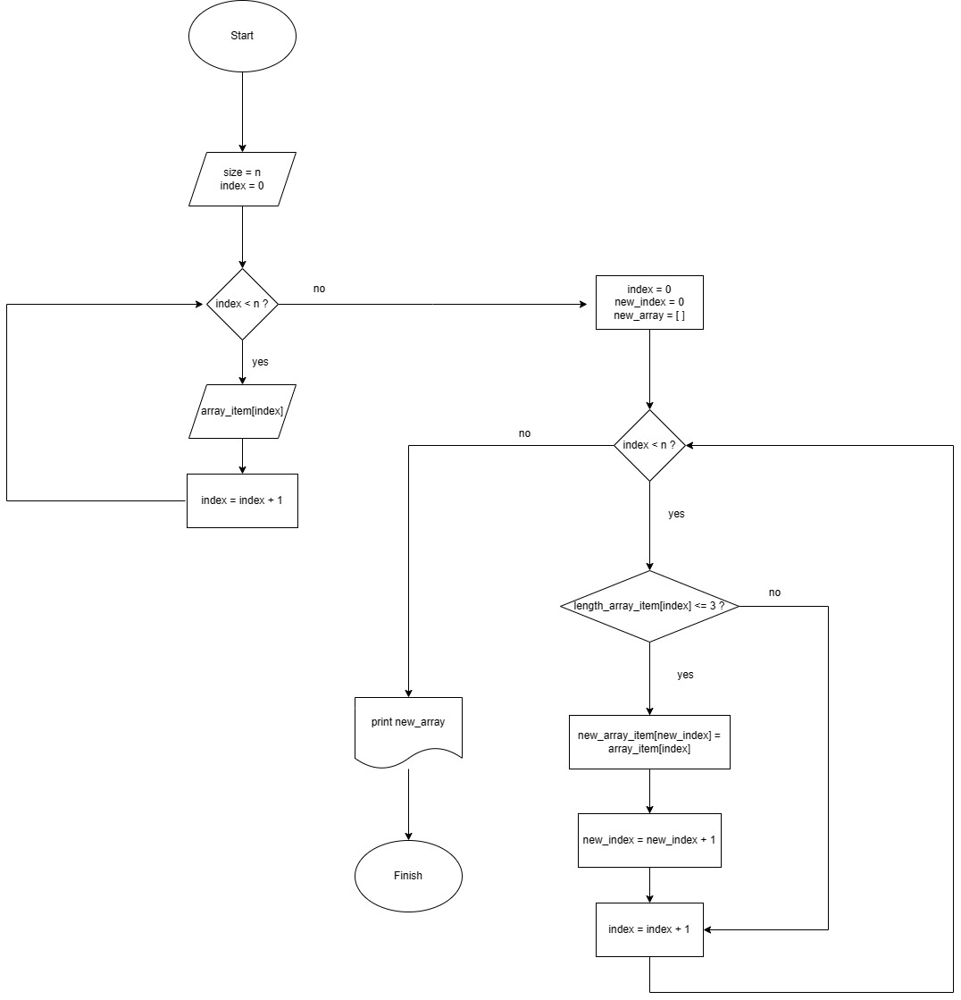

# **Описание решения задачи**
## Блок-схема алгоритма

## **Текстовое описание решения задачи**
### ***Шаг первый - ввод длины массива***
Первым делом выводим на экран запрос с текстом "Введите количество элементов массива:". В появившейся строке пользователь указывает целое число.
### ***Шаг второй - ввод элементов массива***
В зависимости от числа, введенного пользователем на предыдущем этапе, предлагаем поочередно ввести каждый из элементов (числа, слова, знаки пунктуации).
### ***Шаг третий - формирование нового массива путем проверки длины каждого из элементов***
Задаем алгоритм, благодаря которому выполняется проверка каждого из элементов на количество символов: в новый массив попадают только те элементы, длина которых меньше или равна 3 символам.
### ***Шаг четвертый - вывод нового массива***
Выводим на экран ответ "Новый массив из строк, длина которых меньше или равна 3 символам:". В следующей строке через запятую перечисляются элементы нового массива.